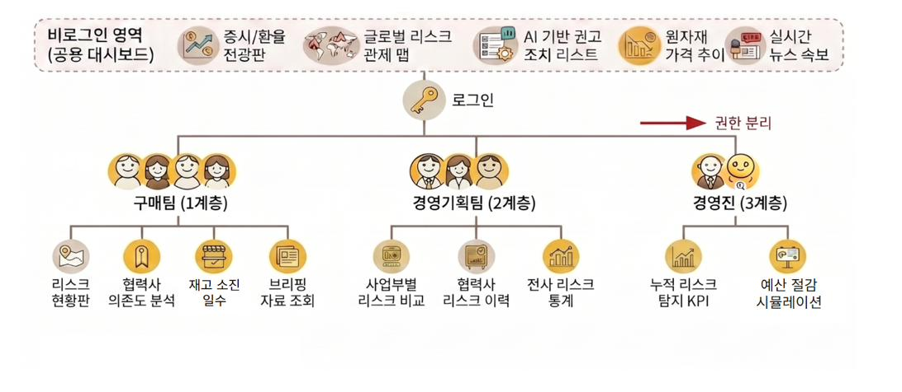

# 배터리 원자재 공급망 리스크 관제 AI 에이전트 — Frontend

2차전지(배터리) 제조사의 구매팀을 대상으로, 리튬·코발트·니켈 등 핵심 원자재의 가격 변동과 지정학적 리스크를 상시 감지하고 사내 계약 조건·ERP 실적 데이터와 자동으로 대조해 구매 담당자와 의사결정자가 신속히 판단할 수 있도록 돕는 AI 기반 의사결정 지원 플랫폼의 React 대시보드입니다.

사용자는 3계층으로 나뉩니다: 리스크가 실제로 탐지·대응되는 **구매팀(1계층, 실무)**, 이를 집계해 전사 관점 패턴을 보는 **경영기획팀(2계층)**, 압축된 핵심 지표로 최종 의사결정을 내리는 **경영진(3계층)**. 백엔드 레포와 분리된 별도 레포로 운영되며, 이 레포만으로 프론트엔드 개발·리뷰가 완결됩니다.

핵심 원칙(화면 전반에 적용):
- **비예측 원칙** — 미래 가격·리스크를 예측하지 않는다(경영진 대시보드의 "예상 절감액"은 시뮬레이션임을 명시하는 예외).
- **하이브리드 신뢰도 표시** — 모든 리스크 판단에 확정/참고/경고 라벨을 표시한다.
- **병기 원칙** — ERP 관점과 RAG(계약) 관점 결과를 하나로 합치지 않고 나란히 제시한다.
- **내부 참고자료 한정** — 산출물은 대외 발송 문서가 아니라 내부 참고 자료다.

## 서비스 플로우



비로그인 공용 대시보드(증시/환율, 글로벌 리스크 맵, AI 권고, 원자재 가격 추이, 뉴스 속보)에서 로그인하면 구매팀(1계층)/경영기획팀(2계층)/경영진(3계층)으로 권한이 분리되고, 계층마다 서로 다른 화면 구성이 제공됩니다.

## 기술 스택

- **React 19 + TypeScript + Vite**
- **react-router-dom** — 클라이언트 라우팅
- **서버 상태**: TanStack Query (`useQuery` 중심)
- **UI 상태**: React 기본 `useState`/`Context` — 별도 상태관리 라이브러리 미도입
- **스타일**: CSS Modules (`*.module.css`), 디자인 토큰은 `src/styles/tokens.css`로 전역 관리
- **차트**: Recharts
- **e2e 테스트**: Playwright

## 폴더 구조

```
src/
  api/                  # 백엔드 연동 — 현재는 mock 함수, 응답 타입(api/types.ts) 우선 정의
  app/                  # 최상위 라우트 정의(routes.tsx) + 로그인 가드
  assets/               # 정적 리소스
  components/
    layout/             # 공통 레이아웃: Header, Footer, SideNav, Breadcrumb, SkipLink
    ui/                 # 공통 UI 요소: ConfidenceBadge, RiskGradeBadge
  features/             # 화면 단위 경계 — 폴더별로 독립적으로 작업 가능
    auth/                 # 로그인/회원가입/승인대기 락 화면
    executive/            # 3계층 경영진 대시보드
    planning/             # 2계층 경영기획팀 대시보드
    public/               # 비로그인 공개 대시보드
    purchasing/           # 1계층 구매팀 대시보드
  lib/                  # 공용 유틸(risk_event_id 파싱 등), 인증 상태(Context)
  styles/               # 디자인 토큰(tokens.css) 등 전역 스타일
e2e/                    # Playwright e2e 테스트
docs/                   # 기획·요구사항·스키마·로드맵·타임라인 문서
docs-ref/               # Figma, 서비스 플로우, UI 데모 이미지 등 참고 자료(미확정)
.github/workflows/      # CI(GitHub Actions)
```

각 `features/{screen}`은 화면 단위 경계로 설계되어, 여러 사람이 동시에 작업해도 서로 다른 폴더만 건드리면 충돌이 없습니다. `components/`(공통 UI)와 `api/`(백엔드 연동)는 여러 화면이 공유하므로 수정 시 영향 범위를 먼저 확인해야 합니다.

## 실행 방법

```bash
# 의존성 설치
npm install

# 개발 서버 (기본 http://localhost:5173)
npm run dev

# 타입 체크
npm run typecheck

# 린트
npm run lint

# 프로덕션 빌드 (dist/ 생성)
npm run build

# 빌드 결과 미리보기
npm run preview

# e2e 테스트 (Playwright) — 먼저 build로 dist/를 만든 뒤 실행 (vite preview로 서빙)
npm run build
npm run test:e2e
```

## 화면 / 라우트 목록

| 경로 | 설명 | 접근 조건 |
|---|---|---|
| `/` | 비로그인 공개 대시보드(Seq 23) — 글로벌 리스크 관제 맵 / AI 기반 권고 조치 리스트 / 원자재 가격 추이 / 실시간 뉴스 속보 | 누구나 |
| `/auth` | 로그인 / 회원가입(스플릿스크린 + 탭 토글). 승인 대기 상태(PENDING)면 같은 화면 안에서 보안 락 화면으로 전환 | 누구나 |
| `/purchasing` | 1계층 구매팀 대시보드(Seq 24, MVP) | 로그인 필요 |
| `/planning` | 2계층 경영기획팀 대시보드 | 로그인 필요 |
| `/executive` | 3계층 경영진 대시보드 | 로그인 필요 |

"로그인 필요" 라우트는 `app/routes.tsx`의 `RequireAuth`가 지키고 있으나, 이는 메모리 상의 인증 상태(`orgTier`) 유무만 확인하는 **클라이언트 UX 수준 가드**입니다. 새로고침하면 상태가 사라지고, 실제 보안 경계(토큰 검증)는 백엔드가 담당합니다. 현재는 계층 간 접근 제한도 하지 않습니다(예: 구매팀으로 로그인해도 `/planning` 접근 가능).

## 참고 문서

| 문서 | 내용 |
|---|---|
| [docs/product-overview.md](docs/product-overview.md) | 프로젝트 개요, 목표 고객, 핵심 원칙, MVP 범위 |
| [docs/architecture.md](docs/architecture.md) | 시스템 아키텍처 (⚠️ 일부 미확정 — 문서 내 명시) |
| [docs/requirements-frontend.md](docs/requirements-frontend.md) | 화면별 요구사항(Seq ID 매핑) |
| [docs/mock-schemas.md](docs/mock-schemas.md) | API mock 스키마(잠정 계약 — 아래 "API 명세" 참고) |
| [docs/design-tokens.md](docs/design-tokens.md) | 색상·타이포·spacing 디자인 토큰과 근거 |
| [docs/roadmap.md](docs/roadmap.md) | 개발 로드맵(Phase 계획) |
| [docs/timeline.md](docs/timeline.md) | 실제 개발 이력(Phase별 진행 기록, append-only) |

## API 명세

백엔드 API 계약은 아직 확정되지 않았습니다. 현재는 [docs/mock-schemas.md](docs/mock-schemas.md)(그리고 `CLAUDE.md`에 정의된 1계층 `risk_event` 스키마)를 **잠정 계약**으로 삼아, `src/api/` 아래 mock 함수로 프론트엔드를 우선 구현했습니다. 응답 타입을 `src/api/types.ts`에 먼저 정의해뒀기 때문에, 실제 계약이 확정되면 각 `api/*.api.ts` 파일의 구현부(mock 데이터를 실제 fetch 호출로 교체)만 바꾸면 됩니다.

## ERD

데이터베이스 설계(ERD)는 이 레포(프론트엔드) 범위 밖이며, 백엔드 레포에서 관리합니다.

---

## 부록: Vite 템플릿 기본 안내

아래는 프로젝트 생성 시 Vite가 기본으로 넣어준 안내로, ESLint 설정을 더 엄격하게 확장하고 싶을 때 참고용입니다.

# React + TypeScript + Vite

This template provides a minimal setup to get React working in Vite with HMR and some ESLint rules.

Currently, two official plugins are available:

- [@vitejs/plugin-react](https://github.com/vitejs/vite-plugin-react/blob/main/packages/plugin-react) uses [Oxc](https://oxc.rs)
- [@vitejs/plugin-react-swc](https://github.com/vitejs/vite-plugin-react/blob/main/packages/plugin-react-swc) uses [SWC](https://swc.rs/)

## React Compiler

The React Compiler is not enabled on this template because of its impact on dev & build performances. To add it, see [this documentation](https://react.dev/learn/react-compiler/installation).

## Expanding the ESLint configuration

If you are developing a production application, we recommend updating the configuration to enable type-aware lint rules:

```js
export default defineConfig([
  globalIgnores(['dist']),
  {
    files: ['**/*.{ts,tsx}'],
    extends: [
      // Other configs...

      // Remove tseslint.configs.recommended and replace with this
      tseslint.configs.recommendedTypeChecked,
      // Alternatively, use this for stricter rules
      tseslint.configs.strictTypeChecked,
      // Optionally, add this for stylistic rules
      tseslint.configs.stylisticTypeChecked,

      // Other configs...
    ],
    languageOptions: {
      parserOptions: {
        project: ['./tsconfig.node.json', './tsconfig.app.json'],
        tsconfigRootDir: import.meta.dirname,
      },
      // other options...
    },
  },
])

```

You can also install [eslint-plugin-react-x](https://github.com/Rel1cx/eslint-react/tree/main/packages/plugins/eslint-plugin-react-x) and [eslint-plugin-react-dom](https://github.com/Rel1cx/eslint-react/tree/main/packages/plugins/eslint-plugin-react-dom) for React-specific lint rules:

```js
// eslint.config.js
import reactX from 'eslint-plugin-react-x'
import reactDom from 'eslint-plugin-react-dom'

export default defineConfig([
  globalIgnores(['dist']),
  {
    files: ['**/*.{ts,tsx}'],
    extends: [
      // Other configs...
      // Enable lint rules for React
      reactX.configs['recommended-typescript'],
      // Enable lint rules for React DOM
      reactDom.configs.recommended,
    ],
    languageOptions: {
      parserOptions: {
        project: ['./tsconfig.node.json', './tsconfig.app.json'],
        tsconfigRootDir: import.meta.dirname,
      },
      // other options...
    },
  },
])

```
